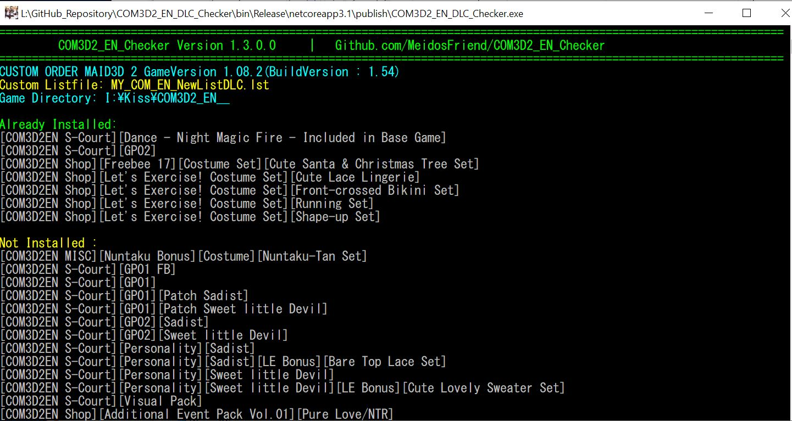
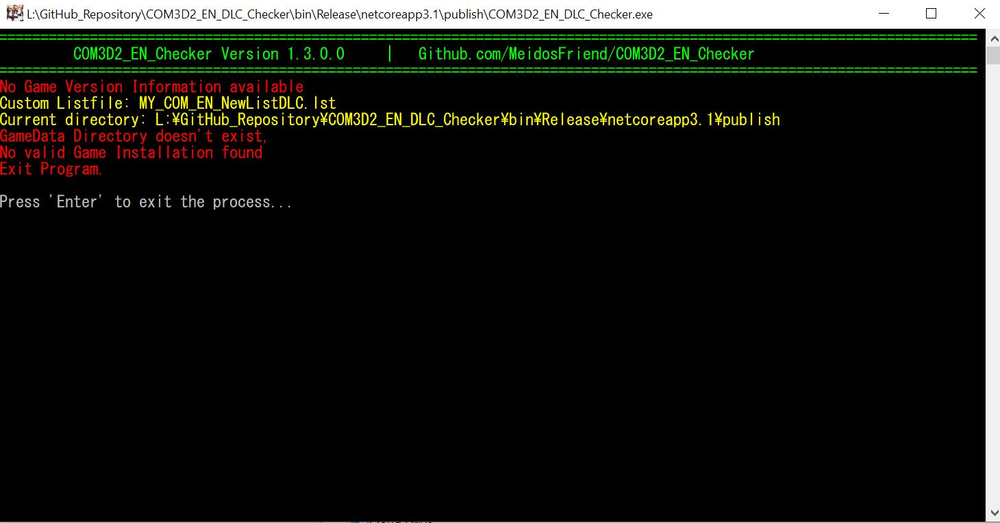

# COM3D2 English DLC Checker V.1.1

App that checking which one DLC have been installed and not.
Always up-to-date if you have an internet connection and I'm still managing the repo.

Listfile update disabled

This screen reflects the choice of a custom listfile

Obviously the current directory does not contain a game, so the program cannot do anything
if you have a game installed, simply delete the ini file

## Components
1) COM3D2_EN_DLC_Checker.exe
2) Listfile COM_EN_NewListDLC.lst
3) Ini File COM3D2_EN_DLC_Checker.ini
4) Custom Listfile MY_COM_EN_NewListDLC.lst (optional) - You have to create this file yourself, if you want it.

## How to Use

1.  Download the latest release
2.  Run "COM3D2_EN_DLC_Checker.exe"

--------------------------------------
The listfile will be downloaded each time you start dlc-checker (configurable)
If no ini-file exists, it will be created

The ini file supports several runtime-parameter:

** COM3D2_EN_DLC_Checker.ini ** 

[GameDirectory]
UseCurrentDir=No

[DLCListFile]
UpdateListFile=Yes
MyDLCListFile=No

---------
UseCurrentDir
- If set to "No" The game directory is read from the registry (only valid when game is installed) (Default)
- "Yes" means the current directory is used (only valid if current dir is a game dir)

UpdateListFile
- If set to "Yes", the actual file COM_EN_NewListDLC.lst is downloaded from Internet, overwriting current file! (Default)
- If set to "No", the current listfile stays untouched, so you can experiment with your list file

MyDLCListFile
- If set to "No", the standard listfile is used (Default)
- If set to "Yes", you can build a listfile from scratch, using another name. This means you can switch between 2 configurations
----------

Hint: If you screwed up your listfile or ini file, simply delete them... 
